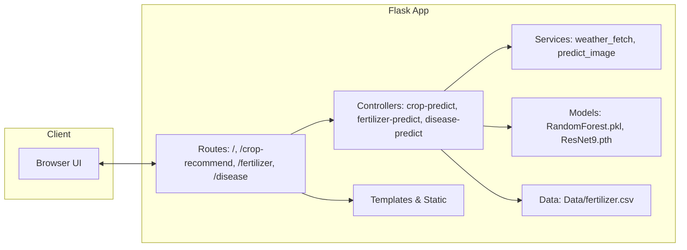
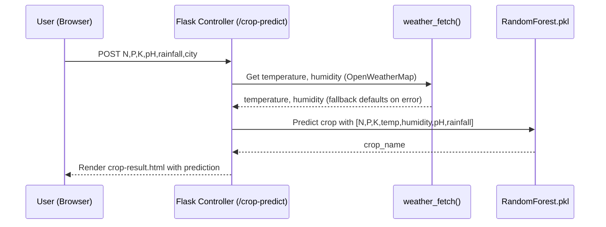
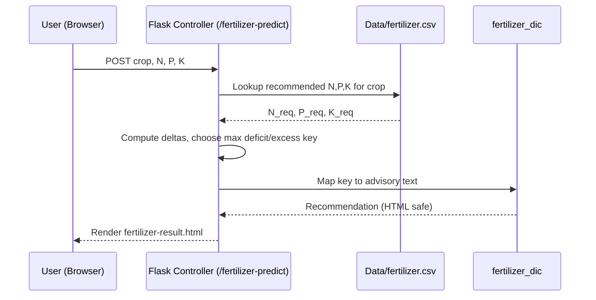
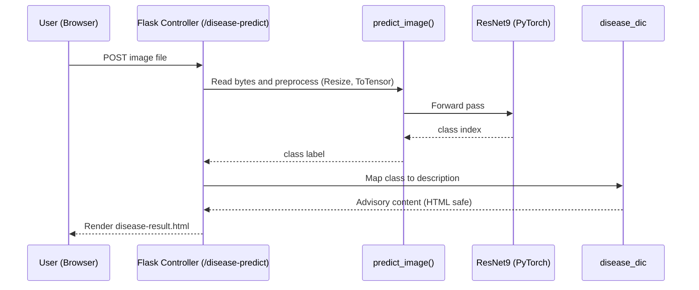
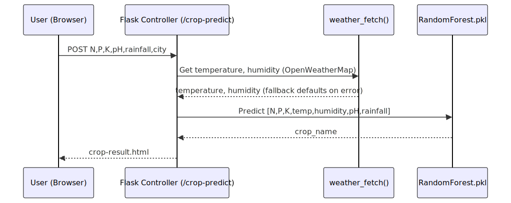
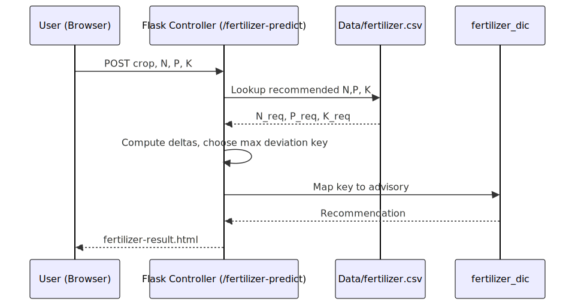
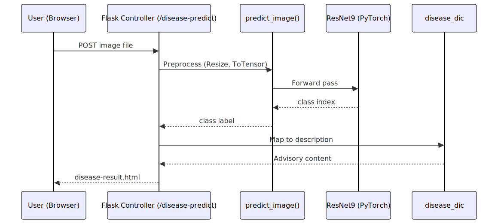

## Hariyali (BHOOMI) - Detailed Working Module Report

### 1. Overview
Hariyali (BHOOMI) is a Flask-based web application that provides:
- Crop recommendation based on soil nutrients, weather, and pH
- Fertilizer recommendation based on target crop and N-P-K gaps
- Plant disease detection from leaf images using a CNN (ResNet9)

Deployed components include a Flask server, scikit-learn model (RandomForest), and a PyTorch model for disease classification.

### 2. High-Level Architecture


### 3. Modules and Responsibilities

- UI Layer (templates, static)
  - `templates/index.html`: Landing page and navigation
  - `templates/crop.html`: Crop input form (N, P, K, pH, rainfall, city)
  - `templates/fertilizer.html`: Fertilizer input form (crop, N, P, K)
  - `templates/disease.html`: Image upload form
  - `templates/*-result.html`: Display prediction outputs
  - Static assets: Bootstrap CSS, images, client JS (e.g., `static/scripts/cities.js`)

- Flask App (`app/app.py`)
  - Routing and controllers
  - Loads models: `models/RandomForest.pkl`, `models/plant_disease_model.pth`
  - Services: `weather_fetch`, `predict_image`
  - Integrates domain dictionaries: `utils/fertilizer.py`, `utils/disease.py`

- Utils
  - `utils/model.py`: ResNet9 architecture
  - `utils/fertilizer.py`: `fertilizer_dic` mapping N/P/K status to advice
  - `utils/disease.py`: `disease_dic` mapping predicted classes to guidance

- Data
  - `app/Data/fertilizer.csv`: Crop-wise recommended N, P, K values
  - `Data-processed/crop_recommendation.csv`: Dataset used during training

### 4. Detailed Flows

#### 4.1 Crop Recommendation Flow


Input features: N, P, K, temperature, humidity, pH, rainfall. Model: scikit-learn RandomForest.

#### 4.2 Fertilizer Recommendation Flow


Logic: identify the nutrient with greatest absolute deviation and pick from `NHigh/Nlow/PHigh/Plow/KHigh/Klow`.

#### 4.3 Disease Detection Flow


Preprocessing: Resize(256), ToTensor, batch dimension. Inference runs on CPU.

### 5. Data Models and Files

- RandomForest crop model: `app/models/RandomForest.pkl`
  - Inputs: [N, P, K, temperature, humidity, pH, rainfall]
  - Output: crop label (string)

- Disease model: `app/models/plant_disease_model.pth`
  - Architecture: ResNet9, 3-channel input, 38 classes
  - Classes defined in `app/app.py` `disease_classes`

- Fertilizer reference: `app/Data/fertilizer.csv`
  - Columns: Crop, N, P, K

### 6. Configuration and Deployment

- Config
  - `app/config.py`: `weather_api_key` for OpenWeatherMap. In production, use environment variables.

- Local run
  - `python app/app.py` (default port 8080), templates served from `app/templates`

- Production
  - `app/Procfile`: `web: gunicorn app:app --log-level debug`
  - Ensure models and data paths are correct relative to `app/`

### 7. Error Handling and Defaults

- Weather API failures fall back to default temperature/humidity (25.0, 60.0)
- Disease upload validates presence of `file`; non-image exceptions render input page

### 8. Security and Privacy Notes

- Do not commit real API keys; use environment variables and secrets management
- Validate and sanitize file uploads; restrict file size and type

### 9. Future Enhancements

- Add unit tests for services and controllers
- Replace blocking external API call with cached or async approach
- Improve preprocessing (normalization) for disease model
- Add localization and accessibility improvements in UI

### 10. Appendix: Route Summary

| Route | Method | Purpose |
| --- | --- | --- |
| `/` | GET | Home page |
| `/crop-recommend` | GET | Crop form |
| `/crop-predict` | POST | Predict crop |
| `/fertilizer` | GET | Fertilizer form |
| `/fertilizer-predict` | POST | Recommend fertilizer |
| `/disease` | GET | Disease form |
| `/disease-predict` | GET/POST | Predict disease |

### 11. Printable Diagrams

Rendered SVGs for printing/sharing:

- Architecture: `docs/diagrams/architecture.svg`
- Component: `docs/diagrams/component.svg`
- Deployment: `docs/diagrams/deployment.svg`
- ERD: `docs/diagrams/erd.svg`
- Sequences:
  - Crop: `docs/diagrams/crop_seq.svg`
  - Fertilizer: `docs/diagrams/fert_seq.svg`
  - Disease: `docs/diagrams/disease_seq.svg`














### 12. Methodology: Agile Scrum with DevOps CI/CD

We adopted an Agile Scrum methodology complemented by DevOps practices to iterate quickly on user-facing features (crop, fertilizer, disease modules) and continuously integrate ML components.

- Sprint-based delivery with planning, development, testing, review, and retrospective
- CI for linting and automated tests; CD for fast, reliable deployments (Gunicorn/WSGI)
- Feedback from monitoring and users flows back into the backlog

```mermaid
%% Included inline for convenience; source of truth in docs/diagrams/methodology.mmd
flowchart LR
  subgraph Agile_Scrum[Agile Scrum]
    P[Product Backlog]
    S((Sprint Planning))
    SB[ Sprint Backlog ]
    D[Design & Data Preparation]
    DEV[Development\\nFlask UI, APIs, ML Models]
    T[Testing\\nUnit, Integration, UX]
    R[Review & Demo]
    RET[Retrospective]
  end

  subgraph DevOps[DevOps CI/CD]
    CI[Continuous Integration\\nLint, Tests]
    ART[Build Artifacts\\nModels, Assets]
    CD[Continuous Delivery\\nDeploy (Gunicorn/WSGI)]
    MON[Monitoring & Feedback\\nLogs, Errors, Metrics]
  end

  P --> S --> SB --> D --> DEV --> T --> R --> RET --> P
  MON --> P
  DEV --> CI --> ART --> CD --> MON
```

Rendered SVG (exported): `docs/diagrams/methodology.mmd` (render via Mermaid), include alongside other diagrams.
